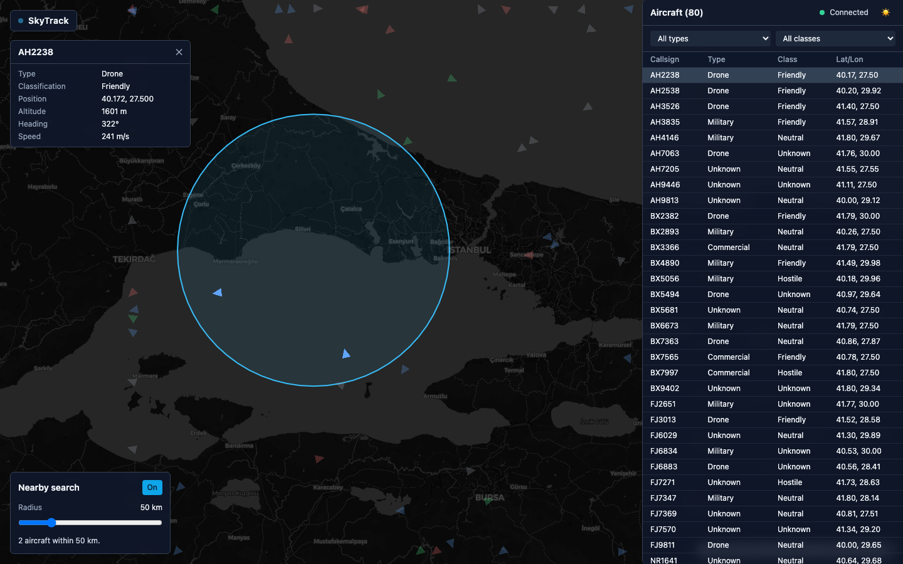
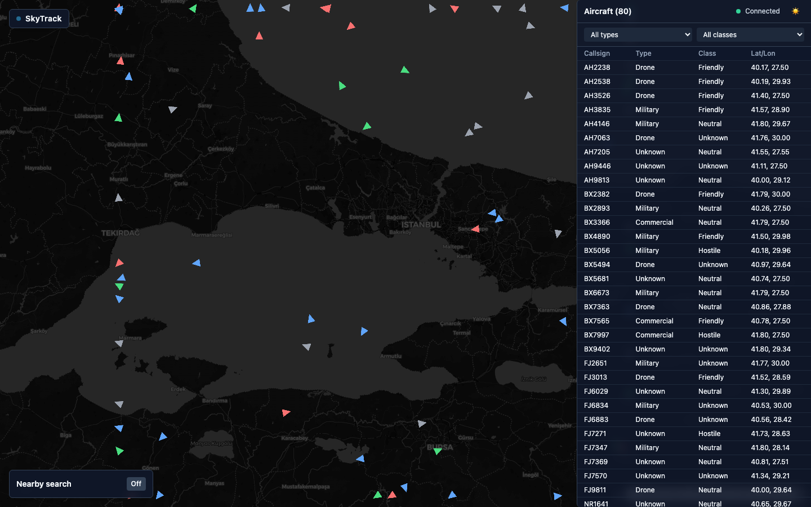
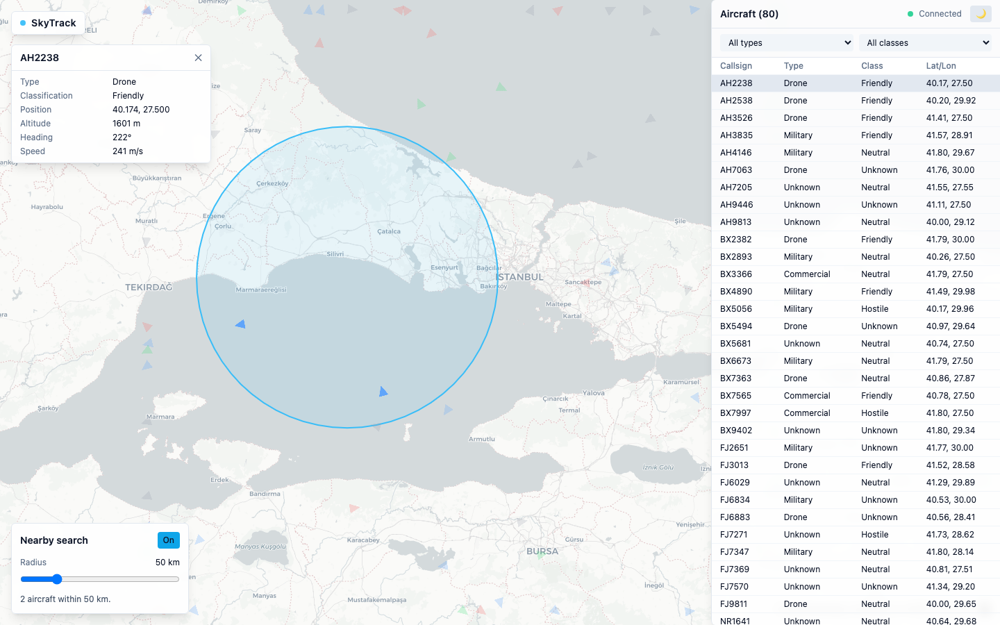
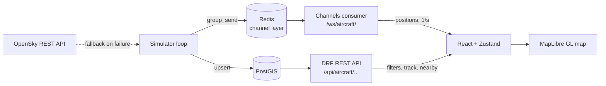

# SkyTrack

A real-time aircraft tracking platform. A simulator (or the live OpenSky
Network API) feeds aircraft positions into PostGIS, positions are
broadcast over WebSockets, and a React/MapLibre UI renders them moving
live on a map — with radius search, trails, filters, and a dark/light
command-center look.

Portfolio project. KISS on purpose: no auth, no microservices, no
Celery, no Kubernetes.



<details>
<summary>More screenshots (light mode, detail card)</summary>




</details>

## Architecture



The ingest command is the project's ETL story: **Extract** (simulator
physics or the OpenSky API) → **Transform** (normalize units, validate,
derive type/classification) → **Load** (PostGIS upsert + a pruned
position-log history for trails).

## Tech stack

| Layer | Technology |
|---|---|
| Backend | Python 3.12, Django 5, Django REST Framework, GeoDjango |
| Realtime | Django Channels + Redis (channel layer) |
| Database | PostgreSQL 16 + PostGIS |
| Frontend | React 18, TypeScript, Vite |
| Map | MapLibre GL JS |
| Styling | Tailwind CSS (dark mode via `class` strategy) |
| i18n | react-i18next |
| State | Zustand |
| Testing | pytest + pytest-django, Vitest + Testing Library |
| Infra | Docker Compose, GitHub Actions CI |

## Quickstart

Requires Docker and the standalone `docker-compose` binary (not the
`docker compose` plugin).

```bash
cp .env.example .env
docker-compose up
```

Then open **http://localhost:5173** — simulated aircraft appear moving
over the Marmara region within a couple of seconds. Migrations run
automatically on backend/ingest startup; no manual steps needed.

- Frontend: http://localhost:5173
- Backend API: http://localhost:8000/api/aircraft/
- WebSocket: `ws://localhost:8000/ws/aircraft/`

## Using the app

- **Filters** — narrow the aircraft table by type/classification.
- **Select** — click an aircraft (map or table) to see its detail card
  and recent flight trail.
- **Nearby search** — turn it on, click anywhere on the map, drag the
  radius slider (10–200 km); matching aircraft are highlighted, the
  rest dim.
- **Theme** — toggle button in the panel header, persisted across
  reloads.

## Environment variables

Set in `.env` (copy from `.env.example`):

| Variable | Default | Purpose |
|---|---|---|
| `DJANGO_SECRET_KEY` | `change-me-in-production` | Django secret key |
| `DJANGO_DEBUG` | `1` | Django debug mode |
| `DJANGO_ALLOWED_HOSTS` | `*` | Django allowed hosts |
| `POSTGRES_DB` / `POSTGRES_USER` / `POSTGRES_PASSWORD` | `skytrack` | PostGIS credentials |
| `POSTGRES_HOST` | `postgis` | PostGIS service host |
| `POSTGRES_PORT` | `5432` | PostGIS service port |
| `REDIS_HOST` / `REDIS_PORT` | `redis` / `6379` | Channels layer backend |
| `DATA_SOURCE` | `simulator` | `simulator` or `opensky` — see below |
| `VITE_WS_URL` | `ws://localhost:8000/ws/aircraft/` | Frontend WebSocket URL |
| `VITE_API_URL` | `http://localhost:8000/api` | Frontend REST base URL |

Setting `DATA_SOURCE=opensky` switches the `ingest` service to poll the
real OpenSky Network REST API over a Turkey bounding box instead of
simulating aircraft. On any fetch failure (rate limit, network) it logs
a warning and falls back to the simulator automatically.

## API summary

REST (`/api/`):

| Endpoint | Description |
|---|---|
| `GET /aircraft/` | List aircraft; filter with `?aircraft_type=` / `?classification=` |
| `GET /aircraft/{callsign}/` | Single aircraft detail |
| `GET /aircraft/{callsign}/track/` | Recent position history (for trail rendering) |
| `GET /aircraft/nearby/?lat=&lon=&radius_km=` | **PostGIS showcase**: aircraft within radius, ordered by distance (`ST_DWithin` + `Distance` annotation) |

WebSocket (`/ws/aircraft/`): the server pushes a batched update roughly
once per second:

```json
{"type": "positions", "aircraft": [{"callsign": "FJ4664", "lat": 40.9, "lon": 28.8, "altitude": 6200, "heading": 134, "speed": 210, "aircraft_type": "COMMERCIAL", "classification": "NEUTRAL"}]}
```

## Testing & CI

```bash
# backend (inside the backend container, or a venv with GDAL/GEOS/PROJ installed)
pip install -r backend/requirements-dev.txt
cd backend && ruff check . && pytest

# frontend
cd frontend && npm run lint && npx vitest run
```

GitHub Actions (`.github/workflows/ci.yml`) runs both on every push and
pull request against `main`.

## Out of scope

Auth/login, user management, admin dashboards beyond Django admin
defaults, mobile app, Celery, message queues beyond the Redis channel
layer, SSR, deployment configs, multiple map providers, historical
playback UI. See `PROJECT_PLAN.md` for the full spec and phase
breakdown, and `PROGRESS.md` for verified implementation status.
